# Multi-Agent System — Full Architecture (Mermaid Diagrams)

> Conceptual architecture of a production-grade multi-agent AI system with orchestration, tool execution, permissions, and distributed execution.

## About This Document

This document contains **14 Mermaid diagrams** that describe the complete architecture of a multi-agent orchestration system. The diagrams are based on reverse-engineering of a real production codebase and verified against actual source code.

### How to Use

- **View diagrams**: Open this file in any Mermaid-compatible renderer — VS Code (Mermaid Preview extension), GitHub, [mermaid.live](https://mermaid.live), or any Markdown viewer with Mermaid support.
- **Navigate**: Each diagram covers a distinct architectural layer. Start with Diagram 1 for the high-level overview, then drill into specific areas.
- **Green elements** (`#00e676`): Indicate components that were discovered or significantly improved during verification — they represent findings that most public analyses missed.
- **Companion document**: See [ARCHITECTURE.md](ARCHITECTURE.md) for a full textual description of every component shown here.

### Diagram Index

| # | Diagram | Focus |
|---|---------|-------|
| 1 | High-Level System Architecture | All modules and connections |
| 2 | Query Loop Lifecycle | Conversation turn sequence |
| 3 | Agent Spawning Flow | 5 execution paths |
| 4 | Coordinator Mode | Multi-worker orchestration phases |
| 5 | Tool Registry & Dispatch | 50+ tools, execution pipeline |
| 6 | Permission System | 7 modes, rule priority flowchart |
| 7 | State Management | Central store, contexts, persistence |
| 8 | MCP Integration | 7 transports, tool marshaling |
| 9 | Plugin & Hook System | 27 events by category |
| 10 | Compaction Strategies | 5 context management approaches |
| 11 | Bridge / Remote Architecture | WebSocket remote execution |
| 12 | Message Type Hierarchy | Class diagram of all message types |
| 13 | Agent Communication System | Mailbox, notifications, routing |
| 14 | Prompt Cache Sharing | Cache optimization architecture |

---

## 1. High-Level System Architecture

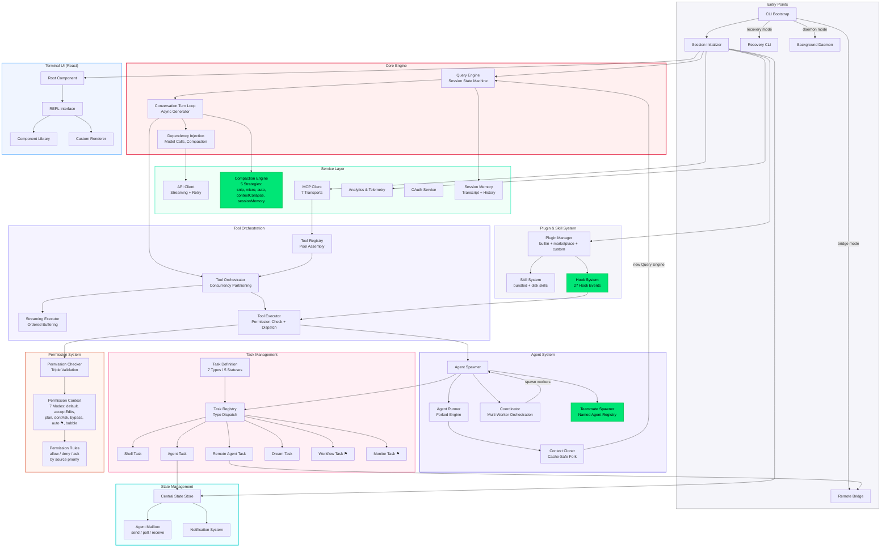

---

## 2. Query Loop — Conversation Turn Lifecycle

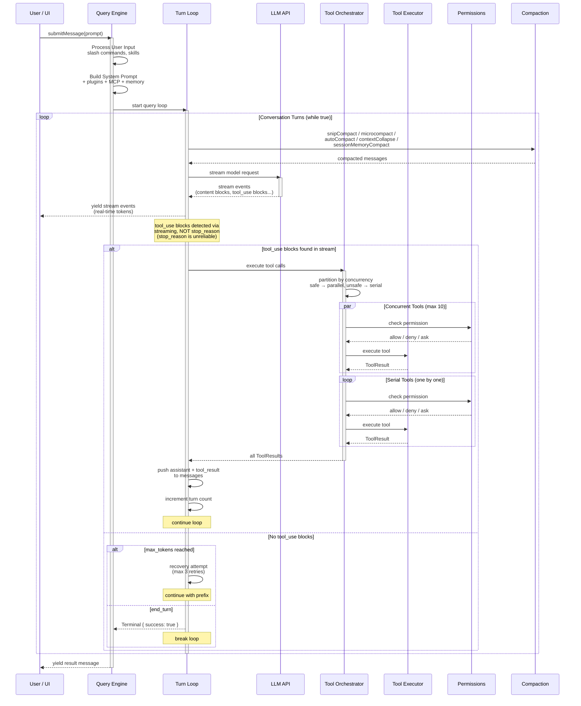

---

## 3. Agent Spawning & Execution Flow

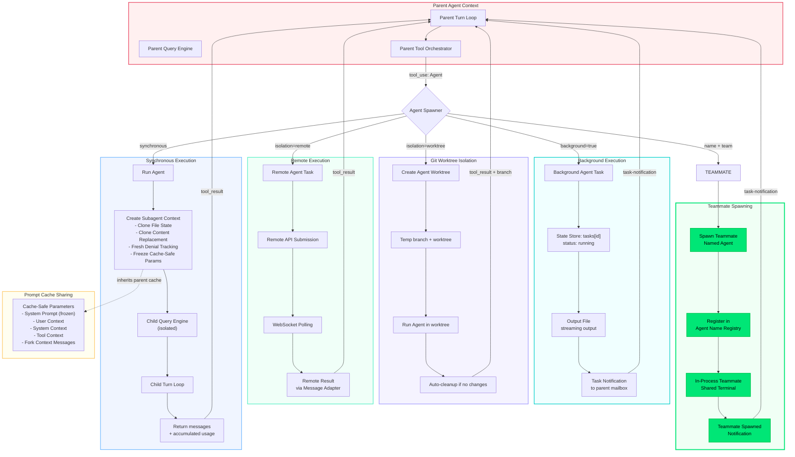

---

## 4. Coordinator Mode — Multi-Worker Orchestration

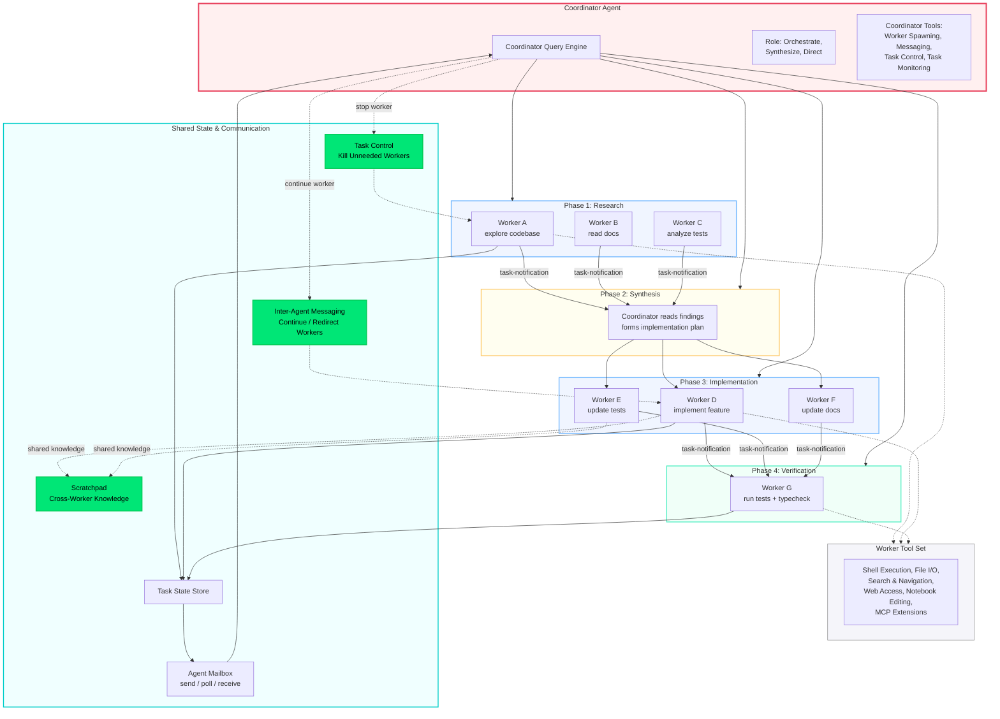

---

## 5. Tool Registry & Dispatch

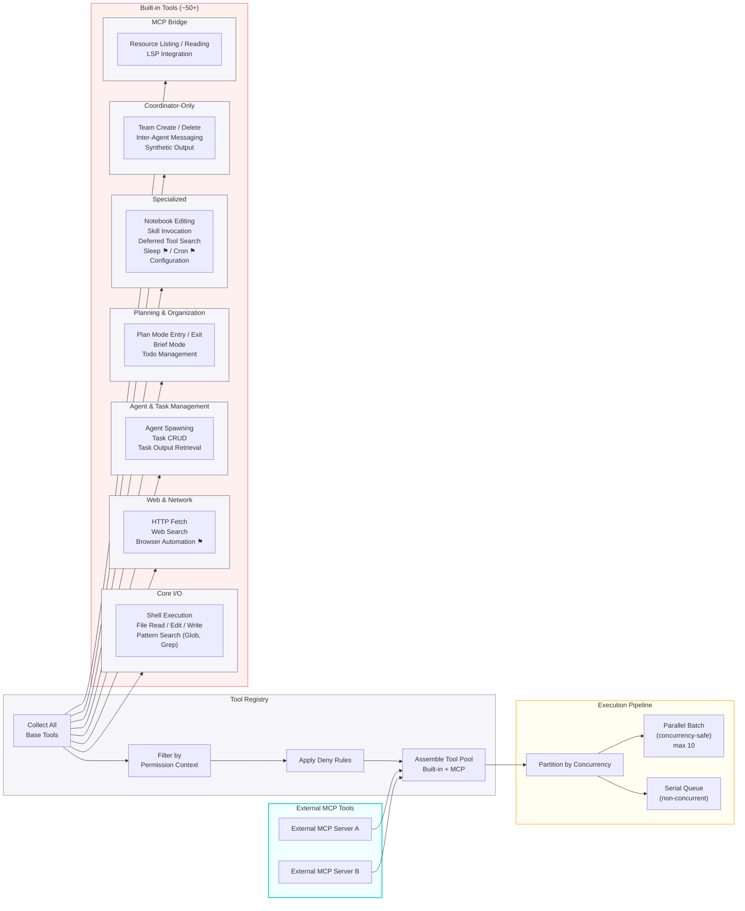

---

## 6. Permission System Flow

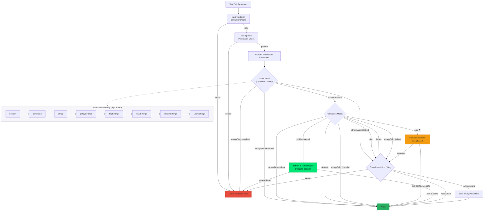

---

## 7. State Management & Data Flow

```mermaid
graph TB
    subgraph AppState["Central State Store"]
        SETTINGS["Settings Configuration"]
        TASKS["Task State Map<br/>id to TaskState"]
        AGENTS["Agent Name Registry<br/>Name-to-ID Mapping"]
        MCP_STATE["MCP State<br/>clients, tools, commands, resources"]
        PLUGINS["Plugin State<br/>enabled, disabled, commands"]
        PERMS["Permission Context"]
        BRIDGE_STATE["Bridge State"]
        UI_STATE["UI State<br/>views, modes, spinners"]
        COMPANION["Companion State"]
    end

    subgraph Contexts["React Contexts"]
        MAILBOX_CTX["Mailbox Provider<br/>send / poll / receive"]
        VOICE_CTX["Voice Provider"]
        MODAL_CTX["Modal Context"]
        OVERLAY_CTX["Overlay Context"]
        NOTIF_CTX["Notification Context"]
        QUEUE_CTX["Queued Message Context"]
        STATS_CTX["Stats Context (FPS)"]
    end

    subgraph Hooks["Key Hooks"]
        USE_CAN["Permission Checker"]
        USE_BRIDGE["Bridge Manager"]
        USE_VOICE["Voice Integration"]
        USE_TYPE["Typeahead"]
        USE_KEYS["Keybindings"]
        USE_INBOX["Inbox Poller"]
        USE_SCROLL["Virtual Scroll"]
    end

    subgraph Persistence["Persistence Layer"]
        CONFIG_JSON["User Configuration"]
        SETTINGS_JSON["Project Settings"]
        TRANSCRIPT["Session Transcripts"]
        FILE_HISTORY["File History"]
        COST_FILE["Session Costs"]
    end

    AppState --> Contexts
    Contexts --> Hooks
    USE_CAN --> PERMS
    USE_BRIDGE --> BRIDGE_STATE
    USE_INBOX --> MAILBOX_CTX
    AppState --> SETTINGS_JSON
    AppState --> CONFIG_JSON
    TASKS --> TRANSCRIPT
    TASKS --> COST_FILE

    style AppState fill:#fff0f0,stroke:#e94560,stroke-width:2px,color:#333
    style Contexts fill:#f3f0ff,stroke:#6c5ce7,stroke-width:2px,color:#333
    style Hooks fill:#f5f3ff,stroke:#a29bfe,stroke-width:2px,color:#333
    style Persistence fill:#fffef0,stroke:#fdcb6e,stroke-width:2px,color:#333
    style AGENTS fill:#00e676,stroke:#00c853,stroke-width:2px,color:#000
```

---

## 8. MCP Integration Architecture

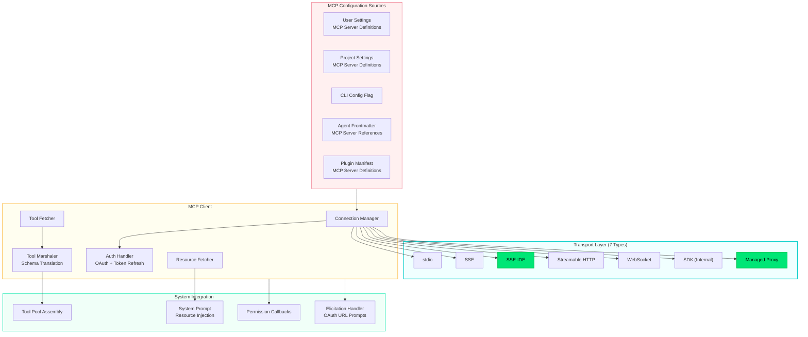

---

## 9. Plugin & Hook System

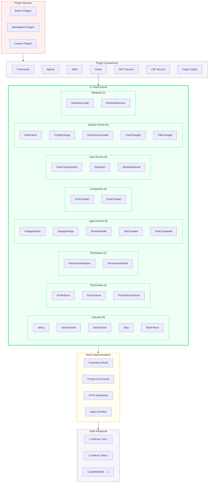

---

## 10. Compaction Strategies

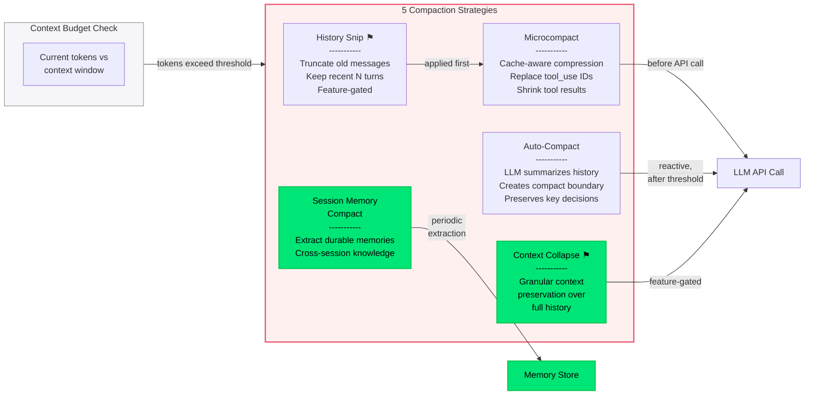

---

## 11. Bridge / Remote Execution Architecture

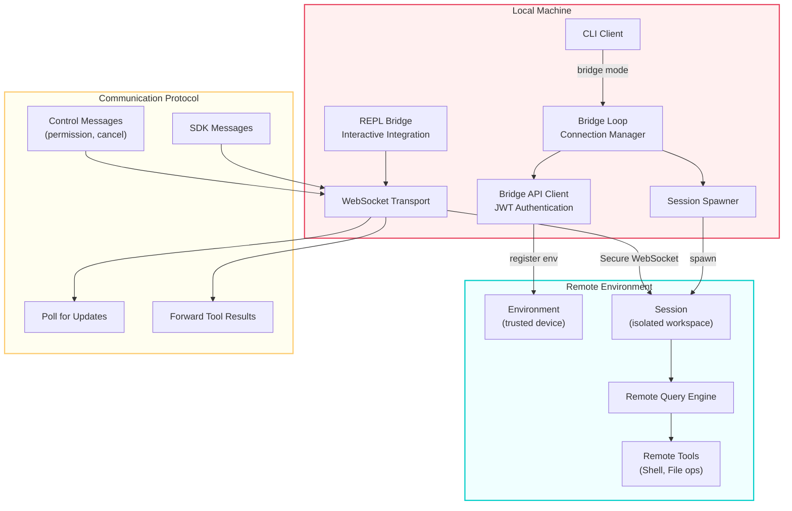

---

## 12. Message Type Hierarchy

```mermaid
classDiagram
    class Message {
        &lt;&lt;union&gt;&gt;
    }

    class UserMessage {
        type: user
        content: ContentBlock[]
        uuid: string
        isMeta: boolean
    }

    class AssistantMessage {
        type: assistant
        message: APIMessage
        costUSD: number
        durationMs: number
        usage: TokenUsage
        model: string
    }

    class AttachmentMessage {
        type: attachment
        content: ContentBlock[]
        source: string
    }

    class ProgressMessage {
        type: progress
        toolUseId: string
        data: ToolProgressData
    }

    class SystemMessage {
        type: system
        content: string
    }

    class ToolUseSummaryMessage {
        type: tool_use_summary
        summary: string
        toolNames: string[]
    }

    class SystemCompactBoundary {
        type: system_compact_boundary
        summary: string
    }

    class TombstoneMessage {
        &lt;&lt;internal&gt;&gt;
        type: tombstone
        originalType: string
    }

    class SDKUserMessage {
        &lt;&lt;sdk&gt;&gt;
        type: sdk_user
        content: ContentBlock[]
    }

    class SDKAssistantMessage {
        &lt;&lt;sdk&gt;&gt;
        message: APIMessage
        usage: TokenUsage
    }

    class SDKPartialAssistantMessage {
        &lt;&lt;sdk-streaming&gt;&gt;
        partial content blocks
        incremental deltas
    }

    Message <|-- UserMessage
    Message <|-- AssistantMessage
    Message <|-- AttachmentMessage
    Message <|-- ProgressMessage
    Message <|-- SystemMessage
    Message <|-- ToolUseSummaryMessage
    Message <|-- SystemCompactBoundary
    Message <|-- TombstoneMessage
    Message <|-- SDKUserMessage
    Message <|-- SDKAssistantMessage
    Message <|-- SDKPartialAssistantMessage

    class TaskState {
        &lt;&lt;base&gt;&gt;
        id: string
        type: TaskType
        status: TaskStatus
        description: string
        startTime: number
        endTime: number
        outputFile: string
        outputOffset: number
        notified: boolean
    }

    class TaskType {
        &lt;&lt;enum&gt;&gt;
        local_bash
        local_agent
        remote_agent
        in_process_teammate
        local_workflow
        monitor_mcp
        dream
    }

    class TaskStatus {
        &lt;&lt;enum&gt;&gt;
        pending
        running
        completed
        failed
        killed
    }

    TaskState --> TaskType
    TaskState --> TaskStatus
```

---

## 13. Agent Communication System

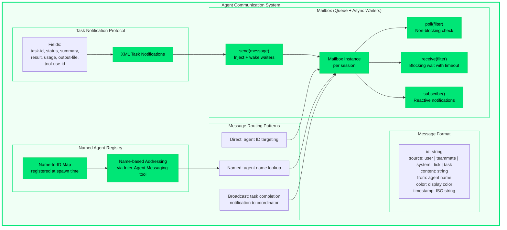

---

## 14. Prompt Cache Sharing

```mermaid
graph TB
    subgraph CacheSharing["Prompt Cache Sharing Architecture"]
        PARENT["Parent Agent<br/>Establishes Cache Breakpoints"]

        subgraph CacheSafe["Cache-Safe Parameters (Frozen at Fork)"]
            SYS_PROMPT["System Prompt<br/>(largest segment, cached first)"]
            USER_CTX["User Context<br/>(instructions, memory files)"]
            SYS_CTX["System Context<br/>(environment, capabilities)"]
            TOOL_CTX["Tool Use Context<br/>(tool definitions, schemas)"]
            FORK_MSG["Fork Context Messages<br/>(conversation prefix)"]
        end

        subgraph CacheKey["API Cache Key Composition"]
            KEY["Cache Key =<br/>System Prompt +<br/>Tool Definitions +<br/>Model ID +<br/>Message Prefix +<br/>Thinking Config"]
        end

        subgraph Children["Child Agents (Inherit Cache)"]
            CHILD_A["Child A"]
            CHILD_B["Child B"]
            CHILD_C["Child C"]
            CHILD_N["Child N..."]
        end

        subgraph Isolation["Isolation Guarantees"]
            ISO_FILE["File State Cache: cloned"]
            ISO_DENIAL["Denial Tracking: fresh instance"]
            ISO_CONTENT["Content Replacement: cloned"]
            ISO_STATE["App State writes: no-op"]
            ISO_ABORT["Abort Controller: child of parent"]
        end

        subgraph Benefit["Benefits"]
            SAVINGS["Cost Reduction<br/>Significant cache hit<br/>on shared prefix"]
            LATENCY["TTFT Improvement<br/>skip re-processing cached tokens"]
            SCALE["Horizontal Scaling<br/>N agents share 1 cache entry"]
        end
    end

    PARENT --> CacheSafe
    CacheSafe --> KEY
    CacheSafe -->|"frozen, identical"| CHILD_A
    CacheSafe -->|"frozen, identical"| CHILD_B
    CacheSafe -->|"frozen, identical"| CHILD_C
    CacheSafe -->|"frozen, identical"| CHILD_N
    CHILD_A --> Isolation
    CHILD_A --> SAVINGS
    CHILD_B --> SAVINGS
    CHILD_C --> SAVINGS
    SAVINGS --> LATENCY
    LATENCY --> SCALE

    style CacheSharing fill:#f0fff5,stroke:#00e676,stroke-width:3px,color:#333
    style CacheSafe fill:#f0fff5,stroke:#00e676,stroke-width:1px,color:#333
    style CacheKey fill:#f0fff5,stroke:#00e676,stroke-width:1px,color:#333
    style Children fill:#f0fff5,stroke:#00e676,stroke-width:1px,color:#333
    style Isolation fill:#f0fff5,stroke:#00e676,stroke-width:1px,color:#333
    style Benefit fill:#f0fff5,stroke:#00e676,stroke-width:1px,color:#333
    style PARENT fill:#00e676,stroke:#00c853,stroke-width:2px,color:#000
    style SAVINGS fill:#00e676,stroke:#00c853,stroke-width:2px,color:#000
    style LATENCY fill:#00e676,stroke:#00c853,stroke-width:2px,color:#000
    style SCALE fill:#00e676,stroke:#00c853,stroke-width:2px,color:#000
```

---

## Legend

| Symbol | Meaning |
|--------|---------|
|  | New or improved element |
|  | New section (mint fill, green border) |
|  | Core engine group (rose border) |
|  | Agent system group (purple border) |
|  | UI / sync execution group (blue border) |
|  | State / async execution group (teal border) |
|  | Persistence / cache group (yellow border) |
| ⚑ | Feature-gated (conditional loading) |
| **Solid arrow** (→) | Direct dependency or call |
| **Dashed arrow** (⇢) | Async or event-based communication |

14 diagrams: 12 core architecture + 2 agent infrastructure additions.
