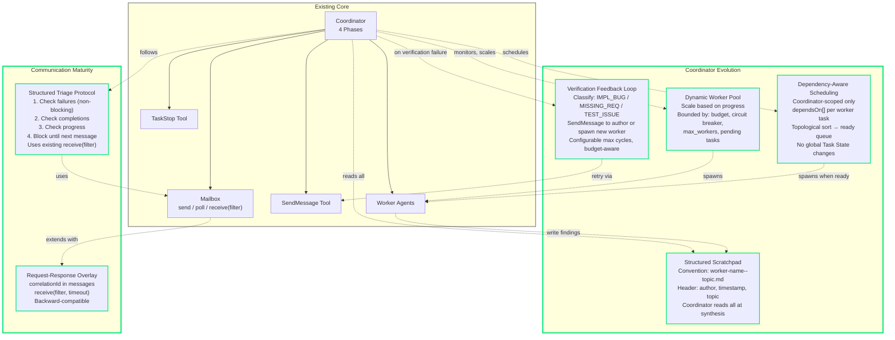

# Architecture Evolution — Diagrams

> Visual overview of proposed improvements. See [EVOLUTION.md](EVOLUTION.md) for full descriptions.

## How to Read

- **Green borders** (`#00e676`) — New components proposed in this evolution
- **Default elements** — Existing architecture (unchanged)
- **Dashed arrows** (⇢) — New interactions proposed
- **Solid arrows** (→) — Existing dependencies

### Affected Existing Diagrams

| Proposal | Affects DIAGRAMS.md |
|----------|-------------------|
| Resilience Layer | Diagram 2 (Query Loop), Diagram 8 (MCP) |
| Budget & Resource Management | Diagram 1 (Overview), Diagram 3 (Agent Spawning) |
| Coordinator Evolution | Diagram 4 (Coordinator) |
| Communication Maturity | Diagram 13 (Agent Communication) |
| Observability Stack | Diagram 1 (Overview), Diagram 7 (State) |
| Adaptive Concurrency | Diagram 5 (Tool Registry) |
| Agent Strategy Memory | Diagram 10 (Compaction) |
| Security Hardening | Diagram 6 (Permissions), Diagram 9 (Hooks) |

---

## Diagram 1. Resilience & Budget (Phase 1)

```mermaid
graph TB
    subgraph Existing["Existing Core"]
        QE["Query Engine"]
        QL["Turn Loop"]
        API["API Client"]
        AGENT_SPAWN["Agent Spawner"]
        COORD["Coordinator"]
        MCP["MCP Client<br/>Connection Manager"]
        TASKS["Task Management<br/>outputFile + outputOffset"]
        ANALYTICS["Analytics & Telemetry"]
        COMPACT["Compaction Engine"]
    end

    subgraph Resilience["Resilience Layer"]
        CB["Circuit Breaker<br/>CLOSED → OPEN → HALF_OPEN<br/>Per API endpoint, session-shared"]
        AFR["Agent Failure Recovery<br/>TRANSIENT → retry via SendMessage<br/>PERSISTENT → new worker + context<br/>FATAL → mark failed, replan<br/>DREAM → no retry, optional"]
        MCP_DEG["MCP Graceful Degradation<br/>CONNECTED → DEGRADED → OFFLINE<br/>Exponential backoff 1s→60s<br/>Tool state transitions"]
        FAIL_NOTIF["Structured Failure Notifications<br/>failure-type, completed-steps,<br/>last-output-offset, error-context<br/>Extends existing outputFile"]
    end

    subgraph Budget["Budget & Resource Management"]
        HIER["Hierarchical Budget<br/>Session → Coordinator → Workers<br/>softLimit / hardLimit<br/>Reserve pool for retries"]
        INHERIT["Budget Inheritance<br/>max(minChildBudget, parent×0.3)<br/>Depth guard at level 5<br/>Unused returns to reserve"]
        ROUTE["Cache-Aware Model Routing<br/>effectiveCost = tokens × (1-cacheHitRate)<br/>Route: opus → sonnet → haiku<br/>Refuse spawns below floor"]
    end

    QL -->|"API calls"| API
    QL -.->|"wraps with"| CB
    CB -.->|"state shared"| API
    COORD -.->|"classifies failures"| AFR
    AFR -.->|"reads partial"| TASKS
    MCP -.->|"state transitions"| MCP_DEG
    AFR -.->|"extends"| FAIL_NOTIF
    AGENT_SPAWN -.->|"allocates"| HIER
    HIER -.->|"child budget"| INHERIT
    INHERIT -.-> AGENT_SPAWN
    HIER -.->|"selects model"| ROUTE
    HIER -.->|"emits events"| ANALYTICS
    COMPACT -.->|"preserves"| HIER

    style Existing stroke:#888,stroke-width:2px
    style Resilience stroke:#00e676,stroke-width:3px
    style Budget stroke:#00e676,stroke-width:3px
    style CB stroke:#00e676,stroke-width:2px
    style AFR stroke:#00e676,stroke-width:2px
    style MCP_DEG stroke:#00e676,stroke-width:2px
    style FAIL_NOTIF stroke:#00e676,stroke-width:2px
    style HIER stroke:#00e676,stroke-width:2px
    style INHERIT stroke:#00e676,stroke-width:2px
    style ROUTE stroke:#00e676,stroke-width:2px
```

---

## Diagram 2. Coordinator & Communication (Phase 2)

---

## Diagram 3. Observability, Security & Optimization (Phases 3-4)

```mermaid
graph TB
    subgraph Existing["Existing Core"]
        TRANSCRIPTS["Session Transcripts"]
        CLONE["createSubagentContext()<br/>6 cloned fields"]
        HOOKS["Hook System<br/>27 events"]
        PERM["Permission System<br/>Triple Validation"]
        TOOL_ORCH["Tool Orchestrator<br/>Semaphore (fixed 10)"]
        SESSION_MEM["Session Memory Compact"]
        ANALYTICS["Analytics & Telemetry"]
    end

    subgraph Observe["Observability Stack"]
        TRACING["Distributed Tracing<br/>traceId per request<br/>spanId per operation<br/>7 span types"]
        EXT_TRANSCRIPT["Extended Transcripts<br/>Add trace + events fields<br/>to existing transcript entries<br/>Backward-compatible"]
        METRICS["Performance Metrics<br/>p50/p95/p99 by tool type<br/>Baseline after 100 ops<br/>Alert at 2x baseline"]
    end

    subgraph Security["Security Hardening"]
        AUDIT["Permission Audit Log<br/>Structured hook event<br/>Queryable format<br/>Extends PermissionRequest/Denied"]
        QUOTAS["Task-Type-Aware Quotas<br/>research: 500 reads, 0 writes<br/>implementation: 200/50<br/>dream: 50/0<br/>Profiles, not fixed numbers"]
        DETECT["Auto Sensitive Data Detection<br/>Pattern: API keys, tokens, PEM<br/>Context: .env, credentials.*<br/>Runs as PostToolUse hook"]
    end

    subgraph Optimize["Optimization"]
        ADAPTIVE["Adaptive Semaphore<br/>min:2, max:20, initial:10<br/>Source-aware 429 handling<br/>Gradual recovery"]
        WEIGHTS["Latency-Adaptive Weights<br/>Cold start: all weight 1<br/>After profiling: weight = p95/baseline<br/>Max weight: 5, update per 50 calls"]
        PATTERNS["Execution Pattern Index<br/>Extension of Session Memory<br/>taskPattern, workerCount, cost<br/>Per-project memory file"]
        SCORING["Per-Pattern Agent Scoring<br/>Score per (agentType, taskPattern)<br/>Min 5 samples before active<br/>Suggestions, not overrides"]
    end

    CLONE -.->|"adds trace context"| TRACING
    TRACING -.->|"writes to"| EXT_TRANSCRIPT
    TRANSCRIPTS -.->|"extended with"| EXT_TRANSCRIPT
    HOOKS -.->|"forwards events"| EXT_TRANSCRIPT
    ANALYTICS -.->|"receives"| METRICS

    PERM -.->|"emits structured"| AUDIT
    AUDIT -.->|"new hook event"| HOOKS
    PERM -.->|"enforces"| QUOTAS
    HOOKS -.->|"PostToolUse"| DETECT

    TOOL_ORCH -.->|"replaced by"| ADAPTIVE
    ADAPTIVE -.->|"uses"| WEIGHTS
    METRICS -.->|"feeds profiling"| WEIGHTS

    SESSION_MEM -.->|"extracts"| PATTERNS
    PATTERNS -.-> SCORING

    style Existing stroke:#888,stroke-width:2px
    style Observe stroke:#00e676,stroke-width:3px
    style Security stroke:#00e676,stroke-width:3px
    style Optimize stroke:#00e676,stroke-width:3px
    style TRACING stroke:#00e676,stroke-width:2px
    style EXT_TRANSCRIPT stroke:#00e676,stroke-width:2px
    style METRICS stroke:#00e676,stroke-width:2px
    style AUDIT stroke:#00e676,stroke-width:2px
    style QUOTAS stroke:#00e676,stroke-width:2px
    style DETECT stroke:#00e676,stroke-width:2px
    style ADAPTIVE stroke:#00e676,stroke-width:2px
    style WEIGHTS stroke:#00e676,stroke-width:2px
    style PATTERNS stroke:#00e676,stroke-width:2px
    style SCORING stroke:#00e676,stroke-width:2px
```

---

## Implementation Priority

| Phase | Component | Depends On | Impact |
|-------|-----------|------------|--------|
| **1** | Budget & Resource Management | — | High: prevents runaway costs |
| **1** | Resilience Layer | — | High: prevents cascading failures |
| **1** | Structured Event Log | — | High: enables debugging Phase 1-2 |
| **2** | Coordinator Feedback Loops | Budget (cycle cost) | High: handles complex tasks |
| **2** | Task Dependency Graph | — | Medium: smarter scheduling |
| **2** | Request-Response Overlay | — | Medium: structured coordination |
| **2** | Structured Scratchpad (convention) | — | Low: naming convention only |
| **3** | Distributed Tracing | Event Log (Phase 1) | Medium: cross-agent debugging |
| **3** | Performance Metrics + Baselines | Analytics (existing) | Medium: trend analysis |
| **3** | Permission Audit Log | Hook System (existing) | Medium: compliance |
| **4** | Adaptive Concurrency | Metrics (Phase 3) | Medium: throughput optimization |
| **4** | Agent Strategy Memory | Execution data (Phase 1-2) | Low-Medium: improves over time |
| **4** | Dynamic Worker Pool | Budget + Circuit Breaker (Phase 1) | Medium: elastic scaling |
| **4** | Latency-Adaptive Weights | Profiling data (Phase 3) | Low: fine-tuning |

### Hook System Extensions (27 → 31 events)

| New Event | Category | Source Section |
|-----------|----------|---------------|
| `McpServerStateChanged` | System | 1. Resilience |
| `BudgetWarning` | System | 2. Budget |
| `PermissionAudit` | System | 8. Security |
| `VerificationCycleStart` | Agent | 3. Coordinator |

---

## Legend

| Symbol | Meaning |
|--------|---------|
|  | New component (proposed improvement) |
|  | Existing architecture (unchanged) |
| **Solid arrow** (→) | Existing dependency or call |
| **Dashed arrow** (⇢) | New interaction (proposed) |
